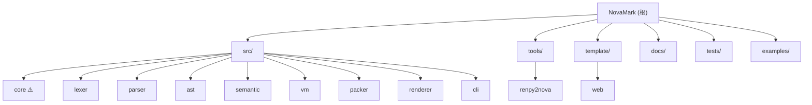

# NovaMark

> 专为文字游戏、互动小说与视觉小说设计的领域专用脚本语言及运行时引擎。

## 项目愿景

NovaMark 通过严格的 VM/渲染器边界将叙事逻辑与渲染层分离，使同一个编译后的游戏包（`.nvmp`）无需修改即可运行于 Web、桌面和移动平台。引擎核心是一个不含任何渲染依赖的纯粹状态机，渲染器被设计为"哑"的——它只接收状态快照并将其绘制出来。

核心设计原则：

- **可移植的游戏包** -- 编译后的 `.nvmp` 文件将所有脚本、资产和元数据打包进单一二进制归档
- **可替换的渲染器** -- 同一个游戏包可运行在终端调试器、WebAssembly 浏览器或原生 C FFI 应用上
- **可序列化的状态** -- 所有游戏状态通过 `NovaState` 结构体流转，存档/读档/回溯均可在渲染器层实现

## 架构总览

NovaMark 采用经典编译管线 + 状态机 VM 架构，数据流为：

```
.nvm 源码 --> Lexer --> Parser --> AST --> SemanticAnalyzer
                                                  |
                            Packer (AstSerializer + AssetBundler)
                                                  |
                                          .nvmp 游戏包
                                                  |
                                          NvmpReader (加载)
                                                  |
                                            NovaVM (执行)
                                                  |
                                        NovaState (状态快照)
                                                  |
                                     IRenderer (渲染器接口)
                                    /        |          \
                              TextMode    WebChat     WebVN
                              (CLI调试)   (WASM)      (WASM)
```

### 技术栈

| 项目 | 决策 |
|------|------|
| 语言 | C++17 |
| 构建系统 | CMake 3.16+ |
| 包管理 | vcpkg |
| 测试框架 | GoogleTest |
| 外部依赖 | nlohmann/json (header-only) |
| 错误处理 | 编译期 `Result<T>`，运行时异常 |
| WASM 工具链 | Emscripten |
| 文档站点 | Hugo (中英双语) |

## 模块结构图



> ⚠️ **src/core**：在 `src/CMakeLists.txt` 中通过 `add_subdirectory(core)` 引用，所有模块均链接 `nova-core`。但 `src/core/` 目录和 `include/nova/core/` 头文件（`source_location.h`, `result.h`, `game_metadata.h`）**在当前分支及整个 git 历史中均不存在**。这是一个待实现的占位模块。其他模块通过 `#include "nova/core/..."` 引用它（如 `semantic/diagnostic.h` → `nova/core/source_location.h`），编译需要这些文件存在。

## 模块索引

| 模块 | 路径 | 职责 | 语言 |
|------|------|------|------|
| Core ⚠️ | `src/core/` | 基础类型（SourceLocation, Result, GameMetadata）—— **目录不存在，待实现** | C++17 |
| Lexer | `src/lexer/` | 将 NovaMark 源码切分为 Token 流 | C++17 |
| Parser | `src/parser/` | 将 Token 流解析为 AST | C++17 |
| AST | `src/ast/` | AST 节点定义、快照导出、源码回导 | C++17 |
| Semantic | `src/semantic/` | 四遍语义分析（定义收集、引用检查、结构检查、未使用检查） | C++17 |
| VM | `src/vm/` | 状态机虚拟机，执行 AST 并输出 `NovaState` | C++17 |
| Packer | `src/packer/` | AST 序列化 + 资源打包为 `.nvmp` 二进制归档 | C++17 |
| Renderer | `src/renderer/` | IRenderer 接口、C API、WASM API | C++17 |
| CLI | `src/cli/` | `nova-cli` 命令行工具 (build/run/check) | C++17 |
| renpy2nova | `tools/renpy2nova/` | Ren'Py 到 NovaMark 的转换工具 | C++17 |
| Web Template | `template/web/` | WebAssembly 渲染器模板 (Chat Mode + VN Mode) | JS/C++ |
| Docs | `docs/` | Hugo 文档站点 (中英双语) | Markdown |
| Examples | `examples/` | 示例 `.nvm` 脚本与项目配置 | NovaMark |

## 运行与开发

### 环境要求

- CMake 3.16+
- C++17 编译器 (GCC/Clang/MSVC)
- vcpkg 包管理器

### 构建命令

```bash
# 配置项目 (首次或 CMakeLists 变更后)
cmake -B build -S . -DCMAKE_TOOLCHAIN_FILE=[vcpkg]/scripts/buildsystems/vcpkg.cmake

# 构建全部
cmake --build build --config Release

# 构建单个目标
cmake --build build --target nova-lexer

# 运行全部测试
ctest --test-dir build --output-on-failure

# 运行单个测试
./build/tests/nova-test --gtest_filter=LexerTest.*

# WASM 构建 (需 Emscripten)
cmake -B build-wasm -S . -DCMAKE_TOOLCHAIN_FILE=$EMSDK/upstream/emscripten/cmake/Modules/Platform/Emscripten.cmake -DENABLE_WASM=ON
cmake --build build-wasm
```

### CLI 使用

```bash
# 语法检查与静态分析
./build/src/cli/nova-cli check scripts/

# 编译脚本资源为二进制包
./build/src/cli/nova-cli build scripts/ -o game.nvmp

# 在 Text Mode 下启动调试运行
./build/src/cli/nova-cli run game.nvmp
```

**Text Mode 调试热键：** `Enter` 步进 | `1`-`9` 选项分支 | `S` 存档 | `L` 读档 | `Q` 退出

### 依赖关系图

```
nova-cli --> nova-packer --> nova-vm --> nova-ast --> nova-parser --> nova-lexer --> nova-core
          |-> nova-semantic            |-> nova-core
          |-> nova-renderer --> nova-vm, nova-packer
```

## 测试策略

- **框架：** GoogleTest (`gtest`)
- **位置：** `tests/` 目录，包含 `lexer_test.cpp`, `parser_test.cpp`, `semantic_test.cpp`, `vm_test.cpp`, `ast_source_emitter_test.cpp`, `c_api_test.cpp`
- **测试命令：** `ctest --test-dir build --output-on-failure`
- **renpy2nova 测试：** `tools/renpy2nova/tests/`，使用 fixture (`.rpy` 输入) + golden (`.nvm` 期望输出) 模式
- **命名约定：** `TEST(ModuleTest, ScenarioDescription)`，中文场景描述可接受
- **覆盖要求：** 每个 Token 类型、每个语法结构、边界条件、错误路径均需测试

## 编码规范

### 命名约定

| 类别 | 风格 | 示例 |
|------|------|------|
| 命名空间 | 小写下划线 | `nova::lexer` |
| 类/结构体 | 大驼峰 | `class Lexer`, `struct Token` |
| 函数/方法 | 小写下划线 | `void tokenize()` |
| 私有成员 | `m_` 前缀 | `m_source` |
| 常量 | 全大写下划线 | `MAX_TOKEN_SIZE` |
| 枚举值 | 大驼峰 | `TokenType::Identifier` |

### 文件组织

- **头文件：** `include/nova/<module>/<class_name>.h`
- **源文件：** `src/<module>/<class_name>.cpp`
- **头文件保护：** `#pragma once`
- **包含顺序：** 本项目 -> 标准库 -> 第三方
- **公开 API 注释：** 中文 `/// @brief` 文档注释

### 错误处理

- **编译期：** `Result<T>` 返回值（`nova/core/result.h`）
- **运行时：** `NovaRuntimeError` 异常

## AI 使用指引

- 修改引擎核心时，确保不引入渲染依赖（VM 层应保持纯状态机）
- 新增 AST 节点类型时需同步更新：`ast_node.h` (定义)、`parser.cpp` (解析)、`ast_serializer.cpp` (序列化)、`ast_snapshot.cpp` (快照)、`ast_source_emitter.cpp` (源码回导)、`nvmp_format.h` (opcode)、`vm.cpp` (执行)
- 新增指令语法时需同步更新：`token.h` (Token)、`lexer.cpp` (扫描)、`parser.h/.cpp` (解析)、AST 节点
- 公开 C API 变更需同步更新：`nova_c_api.h` (声明)、`nova_c_api.cpp` (实现)、`nova_wasm_api.h` (WASM API)、`nova_wasm_exports.cpp` (WASM 实现)
- 修改 `.nvmp` 格式时需递增 `NVMP_VERSION` 常量
- 注册重载系统变更需同步更新：`registry.h` (声明)、`registry.cpp` (实现)、`vm.h/cpp` (集成)、`semantic_analyzer.cpp` (警告策略)

## 变更记录 (Changelog)

| 时间 | 操作 | 说明 |
|------|------|------|
| 2026-05-11 08:41:29 | 初始化 | 由 init-architect 自动生成初始项目文档 |
| 2026-05-11 08:49:00 | 补扫 | 深度读取 CLI 和 Web 模板 |
| 2026-05-12 | v1.0 | 同步 src/core；NovaState v2 契约（EndingState/flags/extensions）；注册重载系统（指令/函数/状态字段）；C/WASM/JS API；stateVersion v1→v3 兼容；CustomCommand 全链路；333 测试；中英文 API/指南文档 |
